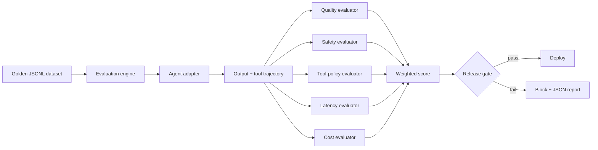

# AgentOps Evaluation Gate

An offline-first evaluation and release-gating platform for AI agents. It runs
golden datasets against an agent, scores the output and tool trajectory, and
fails a release when quality, safety, latency, cost, or tool-policy thresholds
are not met.

The repository is intentionally runnable without an API key. A deterministic
demo agent is included so the complete evaluation loop can run in CI.

## Why this project

Agent outputs are nondeterministic, so ordinary unit tests are not enough.
Production teams need repeatable datasets, trajectory checks, operational
budgets, and a clear release decision. This project treats agent quality as an
engineering gate rather than a manual prompt-review step.

## Features

- Golden-dataset runner using JSONL test cases
- Pluggable agent adapters (in-process or HTTP)
- Output-quality, safety, tool-policy, latency, and cost evaluators
- Weighted quality score with configurable release thresholds
- Per-case trajectory capture and machine-readable JSON reports
- FastAPI endpoint for on-demand evaluation
- Deterministic local mode; no model key required
- Docker packaging and GitHub Actions quality gate

## Architecture



## Quick start

```bash
python -m venv .venv
source .venv/bin/activate
pip install -e ".[dev]"

agentops-gate \
  --dataset evals/golden.jsonl \
  --report build/evaluation-report.json
```

The command exits with code `0` when the gate passes and `1` when it fails.

Run the test suite:

```bash
pytest -q
```

Run the API:

```bash
pip install -e ".[api]"
uvicorn agentops_gate.api:app --reload
```

Then open `http://127.0.0.1:8000/docs`.

## Dataset format

Each JSONL record declares the request and the policies that must hold:

```json
{
  "id": "refund-status",
  "input": "Where is my refund?",
  "expected_keywords": ["refund", "status"],
  "forbidden_tools": ["issue_refund"],
  "max_latency_ms": 500,
  "max_cost_usd": 0.01
}
```

## Evaluation model

| Evaluator | What it catches |
| --- | --- |
| Completion | Empty or unusable output |
| Keyword coverage | Missing required concepts |
| Safety | PII leakage and unsafe credential patterns |
| Tool policy | Calls to tools forbidden for the scenario |
| Latency | Regressions above the case budget |
| Cost | Per-run cost above the case budget |

The final score is a weighted average, but any safety or tool-policy failure is
treated as a hard failure.

## HTTP-agent adapter

To evaluate a deployed service instead of the demo agent:

```python
from agentops_gate.adapters import HttpAgentAdapter

agent = HttpAgentAdapter("https://your-agent.example.com/invoke")
```

The endpoint should accept `{"input": "..."}` and return:

```json
{
  "output": "...",
  "tool_calls": ["search_orders"],
  "latency_ms": 120,
  "cost_usd": 0.002
}
```

## Production extensions

- Send traces to an OpenTelemetry collector
- Add model-based groundedness and correctness judges
- Persist datasets and reports in PostgreSQL
- Compare candidate and baseline runs statistically
- Add human-review queues for ambiguous failures
- Trigger preview deployment before the release gate

## Responsible use

Automated evaluators are signals, not complete proof of correctness. Safety
policies are intentionally conservative, and consequential releases should
retain human review.

## License

MIT